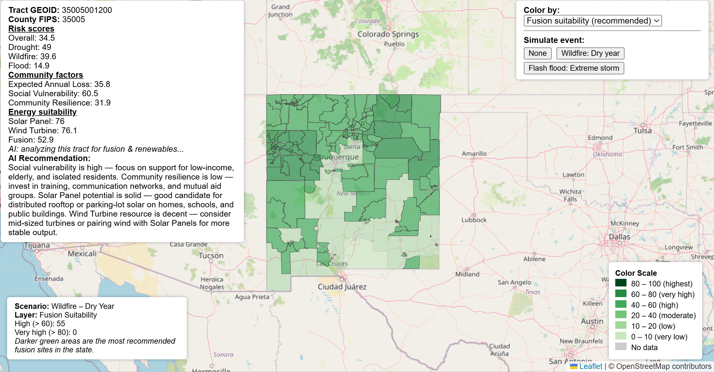
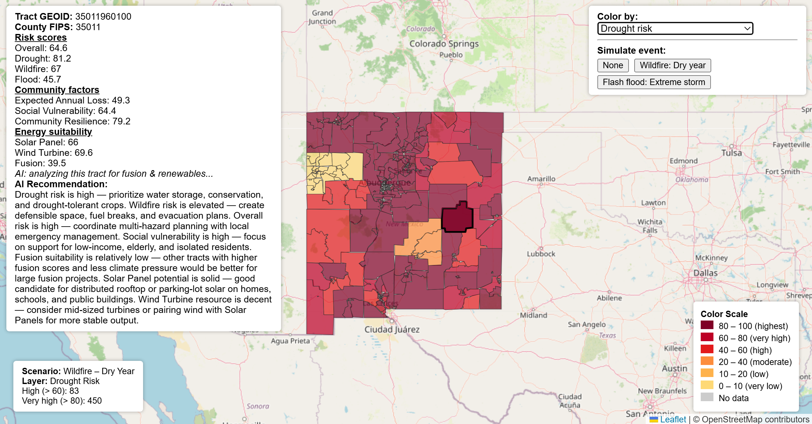

# Resilient New Mexico

### Turning Climate Data into Energy Opportunity

An AI-powered geospatial decision support platform that combines FEMA National Risk Index (NRI) data, climate risk modeling, renewable energy analysis, and interactive GIS visualization to support infrastructure, renewable energy, and advanced energy planning across New Mexico.

This project integrates climate hazards, community resilience metrics, renewable energy suitability, and AI-generated recommendations into a single interactive web application. Users can visualize risk, explore development opportunities, simulate environmental scenarios, and receive contextual recommendations for future planning decisions.

---

## Application Preview

### Fusion & Renewable Energy Suitability



This layer visualizes fusion, solar, and wind suitability across New Mexico using geographic, environmental, and risk-based indicators. Darker regions represent locations with stronger potential for future energy development.

---

### Climate Risk Analysis



This layer visualizes FEMA-derived climate risk information and supports scenario-based analysis for drought, wildfire, and flood events. Users can explore geographic variation in risk and evaluate potential mitigation strategies.

---

## Key Features

* Interactive web-based GIS visualization
* FEMA National Risk Index integration
* County and census tract-level risk analysis
* Climate hazard simulation
* Renewable energy suitability analysis
* Fusion energy site suitability modeling
* AI-generated planning recommendations
* Dynamic layer switching
* GeoJSON-based geospatial processing
* Real-time map interaction through Flask and Leaflet

---

## Technical Highlights

### Geospatial Data Processing

The platform processes and enriches geographic boundary datasets using FEMA National Risk Index information and custom suitability metrics. Data is transformed into GeoJSON layers that can be rendered directly within an interactive mapping environment.

### Risk Modeling

The application incorporates multiple climate-related hazards, including:

* Drought Risk
* Wildfire Risk
* Flood Risk
* Overall Risk Assessment

Users can simulate environmental scenarios to visualize how changing conditions impact development suitability and community risk.

### Renewable Energy Analysis

The platform estimates suitability for:

* Solar Energy Development
* Wind Energy Development
* Fusion Energy Infrastructure

Suitability scores are calculated using geographic and risk-based heuristics to identify regions with favorable development conditions.

### AI-Assisted Recommendations

For every geographic region, the platform generates contextual recommendations based on:

* Hazard exposure
* Community resilience
* Social vulnerability
* Expected annual loss
* Energy suitability metrics

The recommendation engine converts complex risk data into human-readable planning guidance.

---

## Technologies Used

### Backend

* Python
* Flask
* Pandas

### Geospatial Processing

* GeoJSON
* FEMA National Risk Index Data
* Geographic Data Integration

### Frontend

* HTML
* CSS
* JavaScript
* Leaflet.js

### Data Analytics

* Risk Modeling
* Hazard Simulation
* Suitability Scoring
* Decision Support Systems

---

## Repository Structure

```text
README.md

app.py
nri_backend.py
risk_logic.py

prep_nm_geojson.py

nm_tracts_with_risk.geojson

fusion-suitability-map.png
drought-risk-map.png

requirements.txt
```

---

## Running the Application

### Install Dependencies

```bash
pip install -r requirements.txt
```

### Launch the Application

```bash
python app.py
```

Open your browser and navigate to:

```text
http://localhost:5000
```

---

## Key Contributions

* Developed a Flask-based geospatial analytics platform for climate resilience and energy planning.
* Processed and integrated FEMA National Risk Index datasets with geographic tract-level data.
* Designed risk simulation models for drought, wildfire, and flood scenarios.
* Implemented renewable energy and fusion suitability scoring methodologies.
* Built an interactive Leaflet-based visualization interface with dynamic layer switching.
* Developed an AI-assisted recommendation engine that generates planning and mitigation guidance based on geographic risk profiles.

---

## Project Motivation

Climate resilience planning often requires navigating disconnected datasets spread across reports, spreadsheets, and static maps. This project demonstrates how geographic information systems, climate risk analysis, and AI-assisted recommendations can be combined into a unified decision-support platform.

By bringing together hazard data, energy opportunities, and community metrics, the platform helps transform complex environmental information into actionable planning insights.

---

## Future Improvements

* Real-time weather integration
* Additional renewable energy datasets
* Expanded geographic coverage beyond New Mexico
* Advanced machine learning models for site selection
* Infrastructure and grid-capacity analysis
* Enhanced community resilience forecasting

---

## Author

**Kevin Puebla**

Computer Science & Applied Mathematics
University of New Mexico
